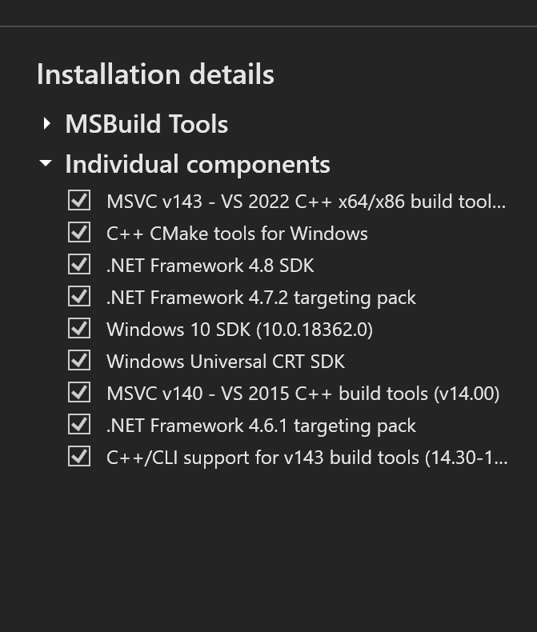

# Rasa_ai_model
AI model for for the Rasa chat bot

# Python Installation
    * Requires python version 3.8.3
    * Make sure this is the default python version you have installed.
    * Change in system environment variables

## Visual C++ Build Tools Installation
    * Download and Instal the free version from: https://visualstudio.microsoft.com/downloads
    * Once you have opened it, go to the individual components tab.
    * Select the following tools one by one then install them.

## Create a virtual environment and activate it.
    * python -m venv virtual
    * .\virtual\Scripts\activate    

## Pip
    * This what we shall be using to install the dependencies    
    * python -m pip install -–upgrade pip

## Install Rasa: 
    * pip install rasa==2.1.2

## Install Rasa x: 
    * pip install rasa-x==0.34.0 --extra-index-url https://pypi.rasa.com/simple    

## Rasa Commands    
    * rasa init - to create a new rasa project. We shall not do this since the project is already set up.
    * rasa train - to train model  

# How to contribute
* Make sure to work on a different branch other than main
* Make sure the features you work are not the same as those of team members
* Always update main and then rebase with you branch before pushing the code to git hub
* Raise a pull request and tag the admin to review    
